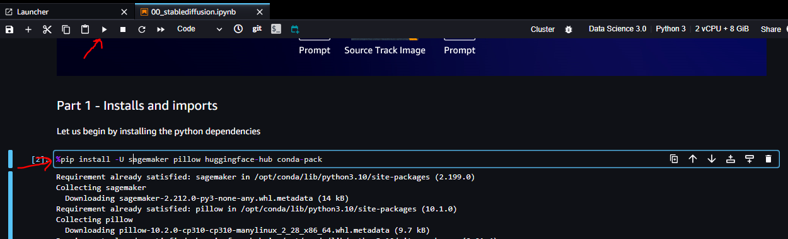

# deepracer-genai-workshop
Community version of [AWS GenAI Workshop](https://catalog.us-east-1.prod.workshops.aws/workshops/d8a88732-5154-49ac-9725-033c0bc74029/en-US/10-aws-account-access) updated to support [DeepRacer for Cloud](https://github.com/aws-deepracer-community/deepracer-for-cloud) / [DeepRacer on the Spot](https://github.com/aws-deepracer-community/deepracer-on-the-spot) and AWS console models.

This workshop runs in us-east-1 region only.

## Costs

This workshop should only cost $2-5 to run, as long as you follow the cleanup steps at the end.  Note - one of the LLMs used is Claude Instant, offered through the AWS Marketplace by Anthropic.  

The use of Claude Instant may not be covered by AWS credits as it's an AWS Marketplace product, it's recommended if you're using AWS Credits to check if they cover marketplace.  In testing this element only cost $0.10 to run the workshop if you're not covered for it with AWS credits.

## Pre-requisites

### Configure AWS Account, Roles and S3 via a CloudFormation script

In order to run this workshop you should have the AWS CLI installed and be [authenticated to AWS](https://docs.aws.amazon.com/cli/latest/userguide/cli-chap-configure.html), or alternatively use [Cloudshell](https://us-east-1.console.aws.amazon.com/cloudshell/home?region=us-east-1) in the AWS console.

- run `git clone https://github.com/aws-deepracer-community/deepracer-genai-workshop.git`
- run `cd deepracer-genai-workshop`
- run `./initial-workshop-setup.sh <aws_bucket_name_to_create>`

### Configure Bedrock LLM Access

- In the AWS console, search for Amazon Bedrock, and select Amazon Bedrock from the list of services, making sure you're in us-east-1.

  
- Next, choose the “Get Started” button in the home page

  
- When clicking on it for the very first time, a pop-up appears in the next page. Choose “Manage model access” in this pop-up.

  
- If this is not the first time you access this page, the Model access button is available in the bottom left of the navigation pane.

  
- Choose the “Manage model access” button again which is visible on the top right side to request access for the needed models

  
- Choose “Submit use case details” button in the “Anthropic” row.

  
- Add the following information to the use case details form, leave the rest as is.
  - Question: "Company name": `Amazon Web Services`
  - Question: "Company website URL": `https://aws.amazon.com/`
  - Question "What industry do you operate in?"
    - Select "Other", add this text: `workshop`
  - Question “Who are your intended users?”
    - Select “Internal employees”
  - Question “Will you be using Anthropic models for any of the following purposes?”
    - Select “None of the above”
  - Question “Describe your use cases (do not share any PII or IP information)”: `Using for DeepRacer workshop`
  - Click the "Submit" button at the end of the form.
  - After submitting the form, the button next to “Anthropic” shows as “Use case details submitted”

   
   - Check the check boxes next “Titan Embeddings G1 – Text” and "Claude Instant" and scroll to the bottom of the page and choose “Request model access”.

   
   - Once requested, the status for Titan Embeddings G1 – Text should immediately be “Access granted”. Claude Instant should change from “Available to request” to “In Progress”. It normally takes around 1 minute for the status to become “Access granted”.

### Setup Sagemaker

- Once you are in the AWS console, select the US East (N. Virginia) us-east-1 region from the menu in the top right-hand corner of the console.

  

- Search for [Amazon SageMaker](https://us-east-1.console.aws.amazon.com/sagemaker/home?region=us-east-1#/landing) in the top search bar and click "Amazon SageMaker" to open the Amazon SageMaker service.

  

- Select Studio located on the left hand side of the screen to access [Amazon SageMaker Studio](https://us-east-1.console.aws.amazon.com/sagemaker/home?region=us-east-1#/studio-landing).

  

- Select WorkshopParticipant as user profile and choose the Open Studio button. If you have more than one domain on Workshop Studio, you would have to select DeepRacerL400GenAI domain before. (It will take around 1-2 minutes to spin up your environment).

  

- If you are no longer using the [Classic SageMaker Studio interface](https://docs.aws.amazon.com/sagemaker/latest/dg/studio-updated.html) , then this terminal will not be in the same location.
    
    - First, you need to navigate to SageMaker Studio Classic.

    
    - Then open the Classic view.

    

- From Amazon Sagemaker Studio open a new Terminal window from File -> New -> Terminal.

  

- Run the following code to download the Jupyter Notebooks, code example and files used in all labs for this workshop.

  `git clone https://github.com/aws-deepracer-community/deepracer-genai-workshop.git`

- Open the file browser to find the downloaded files, and open the deepracer-genai-workshop folder

  

## Lab 1 - AWS DeepRacer model evaluator using Agents

### Introduction

This hands-on workshop demonstrates how to build an intelligent conversational agent using [Amazon Bedrock](https://aws.amazon.com/bedrock/) with [Anthropic Claude](https://aws.amazon.com/bedrock/claude/), a large language model (LLM), combined with the [Langchain](https://python.langchain.com/docs/get_started/introduction) library. The agent is designed to provide insights and recommendations about AWS DeepRacer models and training.

The workshop shows how to:

Create custom Langchain tools to allow the agent to interface with the [AWS DeepRacer](https://aws.amazon.com/deepracer/) service API. This includes listing available models, downloading model artifacts, and extracting model metadata like the training data and reward function.

Initialize a ReAct agent in Langchain and make the custom tools available to it. The agent can reason about which tools to invoke based on the user's questions.

Use prompting techniques like few-shot learning to improve the agent's reasoning capabilities with just a few examples.

Handle errors gracefully if the agent's responses don't match the expected format.

Leverage the custom tools to enable the agent to provide insights about an AWS DeepRacer model's training data, hyperparameters, reward function and more.

By the end of the hands-on workshop, attendees will be able to build conversational agents using LLMs that can integrate with AWS services via custom interfaces. The key takeaways are being able to extend an agent's capabilities using tools, architecting a modular agent, and applying prompting techniques to improve reasoning.

### Architecture

In this lab you will build the following solution, using a Amazon SageMaker studio notebook.

  

#### Langchain

LangChain is a framework for building context-aware applications powered by language models, enabling reasoning and response generation based on provided context and instructions. It provides modular components, off-the-shelf chains, and a developer platform for simplified application development, testing, and deployment.

#### Agents

Agents are AI systems built around large language models (LLMs) as their core engine to enable capabilities beyond just text generation. Agents combine the natural language strengths of LLMs with additional components like planning, memory, and tool use. Planning allows agents to break down complex goals into manageable subtasks. Memory provides short-term, in-context learning and long-term knowledge storage for fast retrieval. Tool use enables agents to gather information and take actions by calling APIs, leveraging search engines, executing code, and more.

Carefully engineered prompts shape agent behavior by encoding personas, instructions, permissions, and context. This allows developers to customize agents for diverse applications like conversational assistants, workflow automation, simulations, and scientific discovery. Key benefits of LLM agents include natural language understanding, reasoning, and self-directed task completion. However, challenges remain around limited context size, unreliable natural language interfaces, and difficulties with long-term planning.

Overall, agents represent an exciting advancement in building AI systems that can collaborate with humans in natural language. Leveraging the strengths of LLMs, agents exhibit reasoning, learning, and autonomous capabilities.

#### Tools

Langchain provides a powerful framework for building conversational agents using large language models (LLMs). One of the key capabilities it enables is the use of custom tools that expand what the LLM can do. Tools allow the LLM agent to interface with external functions, services, and other machine learning models. This massively increases the range of possible capabilities for the agent.

Tools are Python classes that take in text input, perform processing, and return text output. They act as functions the LLM can call. The agent decides which tool to use based on the tool's description. Descriptions are written in natural language so the LLM can understand when a tool is needed.

Tools make it possible to have the LLM leverage other expert models tuned for specific tasks. The LLM acts as the controller, delegating to tools as needed. This is similar to how humans leverage tools and experts to expand our own capabilities.

The key benefits of tools are enabling abilities the LLM does not inherently have and integrating external data sources and functions. The main challenges are properly describing tools so the LLM uses them correctly and managing which tools are available. Overall, custom tools are a powerful way to create extremely versatile LLM agents

#### Reasoning and Act (ReAct)

The agent used in this lab uses a technique called ReAct. ReAct (Reasoning and Acting) is a new paradigm that combines advances in reasoning and acting capabilities of language models to enable them to solve complex language reasoning and decision making tasks. With ReAct, language models can generate reasoning traces to create, maintain, and adjust high-level plans as well as take actions to incorporate additional information from external sources like APIs and knowledge bases.

The key benefit of ReAct is the synergy between reasoning and acting. Reasoning allows the model to induce and update plans while actions enable gathering additional information to support reasoning. This helps address issues like hallucination and error cascading in reasoning-only approaches. ReAct has been shown to achieve superior performance on tasks like multi-hop question answering, fact checking, and interactive decision making compared to reasoning-only and acting-only baselines.

However, ReAct does have some challenges. Non-informative actions can derail reasoning, so retrieving truly informative knowledge is critical. There is also a need for large scale human annotation or interventions to correct reasoning hallucinations and errors. Overall, ReAct demonstrates the promise of combining reasoning and acting in language models for robust and human-like task solving.

#### Getting started with the lab

 - Open the Sagemaker studio notebook which you set up during the environment set up
 - In the file browser navigate to lab 1 by opening the folder '01_model_evaluator_using_agents'

   
- Click on the Jupyter Notebook "00_deepracer_model_evaluation.ipynb". A Set up notebook environment window opens. Select Image: Data Science 3.0, Kernel: Python 3, Instance Type: ml.m5.large, Start-up script: No script.  Then press the 'Select' button.

  
- After a short period the notebook will start.  Continue to follow the instructions in the Jupyter notebook.
- If you're unfamiliar with Jupyter Notebooks they're a combination of documentation and executable code.  To execute a block of code click on the code block and press the 'Play' button at the top of the notebook.  You'll then see the output of the execution below the code block, and there will be a star [*] next to the code block until it finishes executing, when it'll change to a number which increments with each block that is executed.  

  

## Lab2 - Modify AWS DeepRacer track images using Stable Diffusion and analyze learning pattern

### Introduction

In this workshop, you will learn how to leverage generative AI models like Stable Diffusion from [stability.ai](https://stability.ai/) to enhance simulated training data for reinforcement learning. We will cover deploying Stable Diffusion models on Amazon SageMaker , using the models to modify simulated [AWS DeepRacer](https://aws.amazon.com/sagemaker/) track images and add real-world elements, analyzing how improvements to simulated data impact model predictions, and prompt engineering for controlled image generation.

You will gain hands-on experience packaging multiple Stable Diffusion models together, deploying them to a Amazon SageMaker endpoint, querying the endpoint to generate enhanced images, and visualizing how a pre-trained AWS DeepRacer model responds to the improved simulated data.

We will deploy multiple variations of Stable Diffusion on a single Amazon SageMaker Multi-Model GPU Endpoint (MME GPU) powered by [NVIDIA Triton Inference Server](https://docs.aws.amazon.com/sagemaker/latest/dg/triton.html).

This workshop uses references from the [Sagemaker Examples](https://github.com/aws/amazon-sagemaker-examples/tree/main/inference/generativeai/llm-workshop/lab2-stable-diffusion/option3-triton-mme) notebook and the [DeepRacer Log Analysis](https://github.com/aws-solutions-library-samples/guidance-for-training-an-aws-deepracer-model-using-amazon-sagemaker/blob/master/log-analysis/DeepRacer%20Log%20Analysis.ipynb) notebook

The SageMaker Multi-Model Endpoint used requires a minimum of ml.g5.2xlarge to host the Stable Diffusion models required for this lab

### Architecture

### Deep Learning containers

[AWS Deep Learning Containers](https://docs.aws.amazon.com/deep-learning-containers/latest/devguide/what-is-dlc.html) are a set of Docker images for training and serving models in TensorFlow, TensorFlow 2, PyTorch, and Apache MXNet (Incubating). Deep Learning Containers provide optimized environments with TensorFlow and MXNet, Nvidia CUDA (for GPU instances), and Intel MKL (for CPU instances) libraries and are available in the Amazon Elastic Container Registry (Amazon ECR). Amazon SageMaker enables customers to deploy a model using custom code with NVIDIA Triton Inference Server. This functionality is available through the development of Triton Inference Server Containers.

### Image to image diffusion models

In machine learning, diffusion models are a class of generative models that simulate the data generation process. They transform a simple starting distribution into a desired complex data distribution. Some of the Stable Diffusion models like sd_depth, sd_upscale and sd_inpaint can be applied for image-to-image generation by passing a text prompt and a source image. These prompts will help us to precisely condition the output modified images that we want to create.

### Getting started with the lab

- Open the Sagemaker Studio notebook which you set up during the environment setup
- In the file browser navigate to lab 2 by opening the folder '02_stabledifussion'

  

- Click on the Jupyter Notebook "00_stablediffusion.ipynb", a Set up notebook environment window opens. Select Image: Data Science 3.0 and Kernel: Python 3, Instance Type: ml.m5.large, Start-up script: No script.  Then press the 'Select' button.

  

- This notebook requires a minimum of an ml.m5.large instance to build the conda environment required for hosting the Stable Diffusion models.
- After a short period the notebook will start.  Continue to follow the instructions in the Jupyter notebook.
- If you're unfamiliar with Jupyter Notebooks they're a combination of documentation and executable code.  To execute a block of code click on the code block and press the 'Play' button at the top of the notebook.  You'll then see the output of the execution below the code block, and there will be a star [*] next to the code block until it finishes executing, when it'll change to a number which increments with each block that is executed.  

  

## Summary

This hands-on workshop provided you with the opportunity to expand your skills in conversational AI and simulated data enhancement using Amazon's cloud services.

In the first lab, you built a custom conversational agent powered by Anthropic's Claude and integrated it with AWS DeepRacer using the Langchain library.

Topics covered:

- How to build a conversational agent with Amazon Bedrock and Anthropic Claude
- Creating custom Langchain tools to interface with AWS DeepRacer API
- Initializing a ReAct agent in Langchain and providing access to custom tools
- Using prompting techniques like few-shot learning to improve reasoning
- Handling errors gracefully when responses don't match expected format
- Enabling the agent to provide insights on DeepRacer models using custom tools
- The second lab focused on leveraging Stable Diffusion, packaged and deployed on SageMaker, to generate enhanced simulated training data for DeepRacer by modifying track images. You gained first-hand experience in prompt engineering for controlled image generation, analyzing model predictions, and deploying models on SageMaker.

Topics covered:

- Leveraging Stable Diffusion for simulated training data enhancement
- Deploying Stable Diffusion on Amazon SageMaker
- Using models to modify AWS DeepRacer track images and add realism
- Analyzing impact of improved simulated data on model predictions
- Prompt engineering for controlled image generation

## Important - Clean Up

To avoid unnecessary costs if you are using your own account, we recommend running the following clean up procedure.

- Run the clean up section in the Jupyter notebook of each lab.
- Delete all the Apps created under the Domain "DeepRacerL400GenAI" and User "workshopparticipant".
- Open the [SageMaker Console](https://console.aws.amazon.com/sagemaker/).
- On the left navigation pane, choose Admin configurations.
- Under Admin configurations, choose Domains.
- Select the Domain that you want to delete, "DeepRacerL400GenAI".
- Choose the user "workshopparticipant" in the User profiles list.
- On the User Details page, for each non-failed app in the Apps list, choose Action.
- From the dropdown list, choose Delete.
- On the Delete app dialog box, choose Yes, delete app. Then enter delete in the confirmation field, and choose Delete.
- When Status appears as Deleted for all applications, proceed to the next step.
- Delete the CloudFormation stacks that were setup during the AWS account access, [AWS Cloudformation Console](https://console.aws.amazon.com/cloudformation/home?#).
- Inference endpoints stay provisioned until explicitly deleted. If you have already shutdown the Jupyter notebooks without running the cleanup sections, check the [Inference > Endpoints page of the SageMaker console](https://console.aws.amazon.com/sagemaker/home?#/endpoints) for any other running endpoints or check Sagemaker Endpoints  to delete them.
- If you trained new DeepRacer models or used workshop's pre-trained models, you can follow [these steps](https://catalog.workshops.aws/deepracer-200l/en-US/99-cleanup) to delete them.
