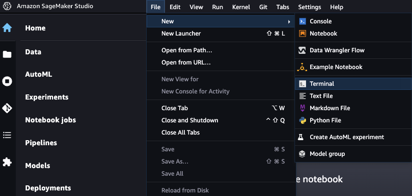

# deepracer-genai-workshop
Community version of [AWS GenAI Workshop](https://catalog.us-east-1.prod.workshops.aws/workshops/d8a88732-5154-49ac-9725-033c0bc74029/en-US/10-aws-account-access) updated to support [DeepRacer for Cloud](https://github.com/aws-deepracer-community/deepracer-for-cloud) / [DeepRacer on the Spot](https://github.com/aws-deepracer-community/deepracer-on-the-spot) and AWS console models.

This workshop runs in us-east-1 region only.

## Costs

This workshop should only cost $2-5 to run, as long as you follow the cleanup steps at the end.  Note - one of the LLMs used is Claude Instant, offered through the AWS Marketplace by Anthropic.  

The use of Claude Instant may not be covered by AWS credits, however in testing this element only cost $0.10.

## Pre-requisites

### Configure AWS Account, Roles and S3 via a CloudFormation script

In order to run this workshop you should have the AWS CLI installed and be [authenticated to AWS](https://docs.aws.amazon.com/cli/latest/userguide/cli-chap-configure.html)

- run `git clone https://github.com/aws-deepracer-community/deepracer-genai-workshop.git`
- run `cd deepracer-genai-workshop`
- run `./initial-workshop-setup.sh <aws_bucket_name_to_create>`

### Configure Bedrock LLM Access

- In the AWS console, search for Amazon Bedrock, and select Amazon Bedrock from the list of services, making sure you're in us-east-1.

  
- Next, choose the “Get Started” button in the home page

  
- When clicking on it for the very first time, a pop-up appears in the next page. Choose “Manage model access” in this pop-up.

  
- If this is not the first time you access this page, the Model access button is available in the bottom left of the navigation pane.

  
- Choose the “Manage model access” button again which is visible on the top right side to request access for the needed models

  
- Choose “Submit use case details” button in the “Anthropic” row.

  
- Add the following information to the use case details form, leave the rest as is.
  - Question: "Company name": `Amazon Web Services`
  - Question: "Company website URL": `https://aws.amazon.com/`
  - Question "What industry do you operate in?"
    - Select "Other", add this text: `workshop`
  - Question “Who are your intended users?”
    - Select “Internal employees”
  - Question “Will you be using Anthropic models for any of the following purposes?”
    - Select “None of the above”
  - Question “Describe your use cases (do not share any PII or IP information)”: `Using Claude Instant for AWS DeepRacer workshop`
  - Click the "Submit" button at the end of the form.
  - After submitting the form, the button next to “Anthropic” shows as “Use case details submitted”

   
   - Check the check boxes next “Titan Embeddings G1 – Text” and "Claude Instant" and scroll to the bottom of the page and choose “Request model access”.

   
   - Once requested, the status for Titan Embeddings G1 – Text should immediately be “Access granted”. Claude Instant should change from “Available to request” to “In Progress”. It normally takes around 1 minute for the status to become “Access granted”.

   ### Setup Sagemaker

- Once you are in the AWS console, select the US East (N. Virginia) us-east-1 region from the menu in the top right-hand corner of the console.

  

- Search for Amazon SageMaker in the top search bar and click "Amazon SageMaker" to open the Amazon SageMaker service.

  

- Select Studio located on the left hand side of the screen to access Amazon SageMaker Studio.

  

- Select WorkshopParticipant as user profile and choose the Open Studio button. If you have more than one domain on Workshop Studio, you would have to select DeepRacerL400GenAI domain before. (It will take around 1-2 minutes to spin up your environment).

  

- If you are no longer using the Classic SageMaker Studio interface , then this terminal will not be in the same location.
    
    - First, you need to navigate to SageMaker Studio Classic.

    
    - Then open the Classic view.

    

- From Amazon Sagemaker Studio open a new Terminal window from File -> New -> Terminal.

  

- Run the following code to download the Jupyter Notebooks, code example and files used in all labs for this workshop.

  `git clone https://github.com/aws-deepracer-community/deepracer-genai-workshop.git`

- Open the file browser to find the downloaded files, and open the deepracer-genai-workshop folder

  
